# Praktikum 1 - $fillable:

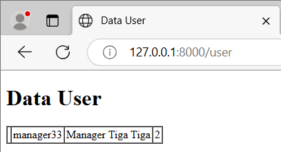

program akan melakukan insert data ke database dan akan terlihat ditampilan web.

Langkah 6:  program terjadi error karena kolom pada variable $fillable harus sesuai dengan kolom yang ada di database.

# Praktikum 2.1 – Retrieving Single Models

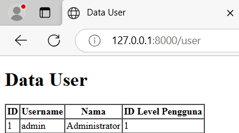

web akan menampilkan user dengan 1 hal ini terjadi karena menggunakan fungsi find() dengan niai 1 yang berguna untuk mencari id=1.

langkah 5: hasilnya sama seperti pada Langkah 3, bedanya yaitu penggunaan fungsinya dengan menggunakan fungsi where dan fungsi first.

langkah 7: hasilnya sama seperti Langkah sebelumnya, bedanya yaitu menggunakan fungsi firstwhere() dengan parameter level_id dengan nilai 1 yang berguna untuk mencari id dengan nilai 1.

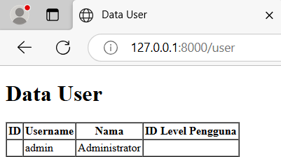

hasilnya web akan menampilkan username dan nama dari id = 1 dengan menggunakan fungsi findor(), tetapi tidak menampilkan id penggunanya. 

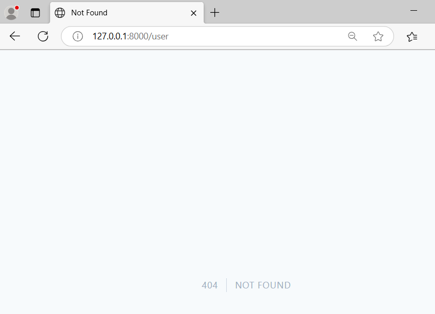

karna pengguna dengan id=20 tidak ditemukan, maka web akan menampilkan halaman 404 dengan menjalankan abort(404).

# Praktikum 2.2 – Not Found Exceptions

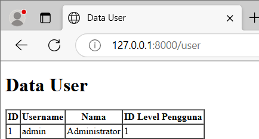

web akan menampilkan data user dengan id=1 dengan menggunakan fungsi findorfail() dengan nilai parameter 1.

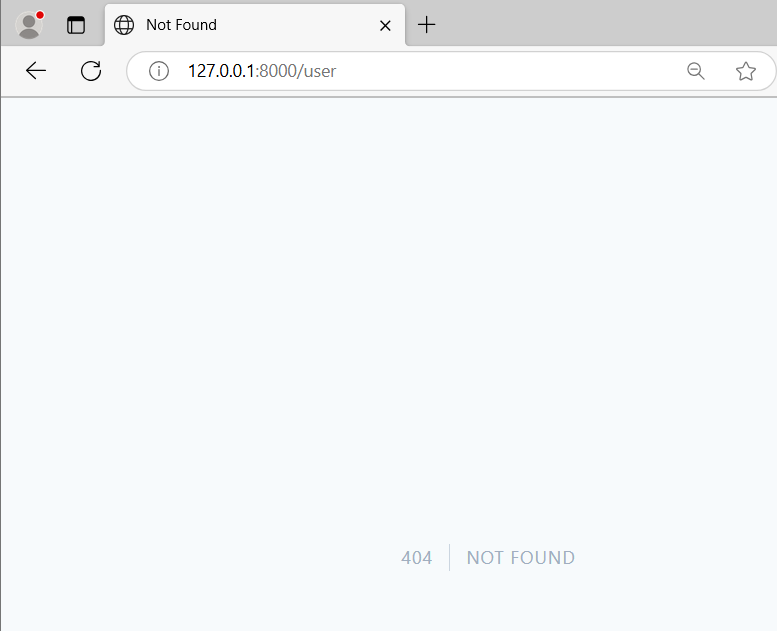

web akan akan menampilkan 404 karena user dengan 'manager9' tidak ditemukan sehingga menampilkan 404 not found.

# Praktikum 2.3 – Retreiving Aggregrates

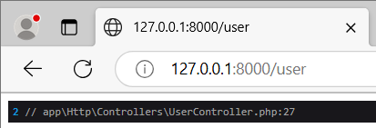

web akan menampilkan informasi baris yang terdapat fungsi dd().

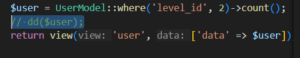

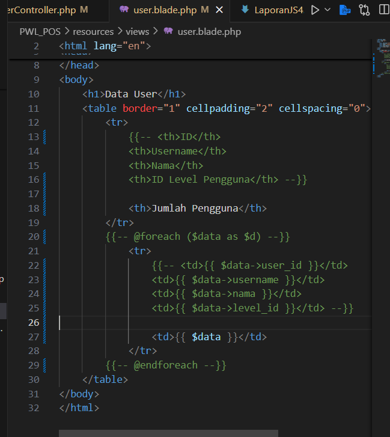

hasil:

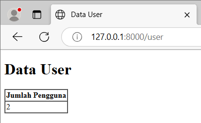

# Praktikum 2.4 – Retreiving or Creating Models

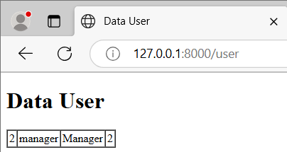

web akan menampilkan data user yang dicari yaitu dengan username 'manager' dan 'Manager'.

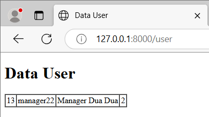

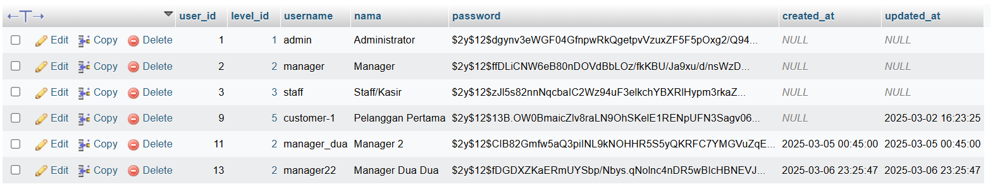

dikarenakan data yang dicari tidak ditemukan maka data yang dicari akan diinsert ke database sehingga web akan menampilkan data yang baru diinsert.

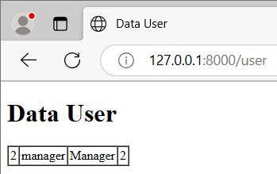

dikarenakan data yang dicari ditemukan maka web akan menampilkan data tersebut.

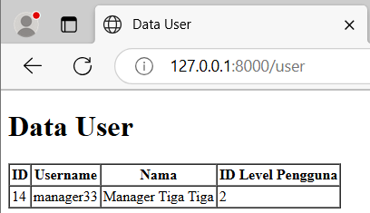

dikarenakan data yang dicari tidak ditemukan maka data tersebut akan dimasukkan ke database, namun terjadi kendala yaitu datanya tidak terdapat pada
database, sehingga web hanya menampilkan username,nama dan level_id.

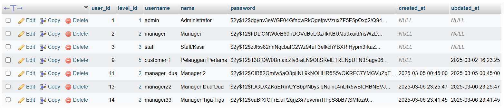

karna data yang dicari tidak ditemukan maka data tersebut akan dimasukkan ke database dan berhasil karena sudah dilakukan save menggunakan fungsi save(), sehingga web akan menampilkan daata tersebut.

# Praktikum 2.5 – Attribute Changes

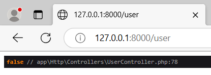

web akan menampilkan console dengan nilai false, dikarenakan tidak ada perubahan pada data tersebut sebelum dan setelah masuk kedalam database.

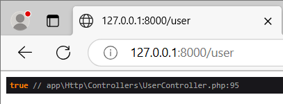

web akan menampilkan console dengan nilai true, dikarenakan terdapat perubahan pada username.

# Praktikum 2.6 – Create, Read, Update, Delete (CRUD)

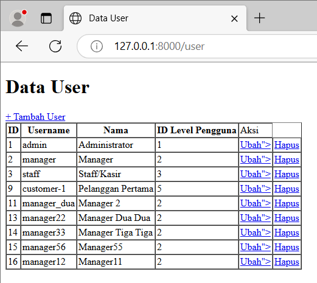

web akan menampilkan seluruh data dari table user dan terdapat link untuk melakukan tambah, edit dan hapus data.

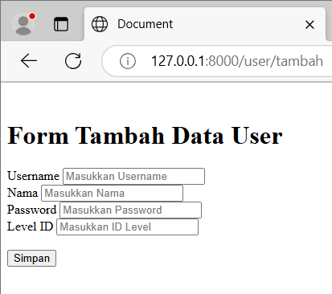

web akan menampilkan error setelah menekan tombol tambah user hal ini terjadi karena route pada action form tidak ditemukan.

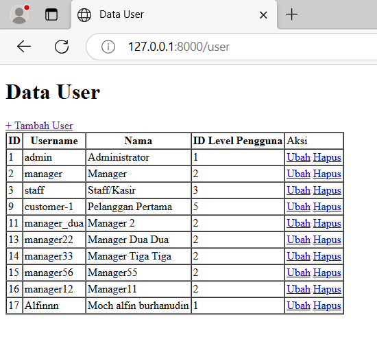

data web yang diinputkan pada form akan tersimpan pada database dan tampil pada tampilan web.

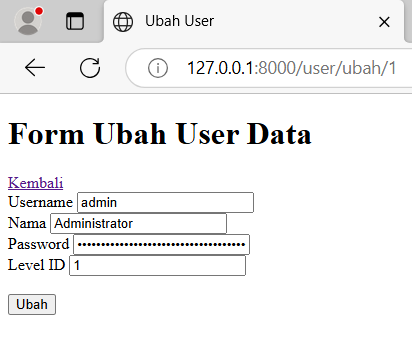

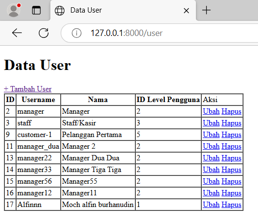

method ini mencari pengguna berdasarkan ID dan menghapusnya dari database. setelah pengguna dihapus, pengguna diarahkan kembali ke halaman daftar pengguna.

# Praktikum 2.7 – Relationships

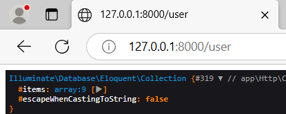

web akan menampilkan informasi proses yang dilakukan di dalam userController yaitu mengembalikan sekumpulan data.

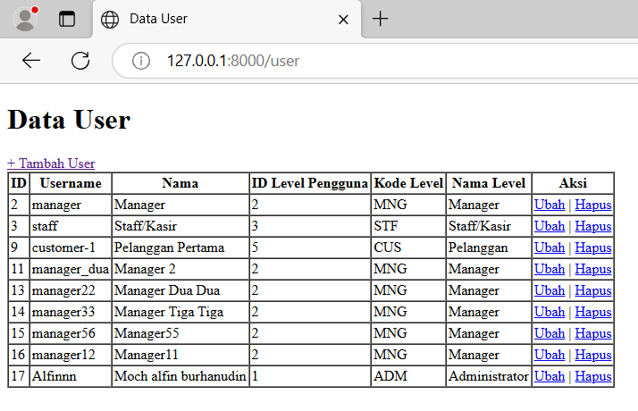

web akan menampilkan seluruh data dari table user beserta menampilkan 2 kolom dari table m_levels yaitu kolom level_kode dan level_nama.

