# Laporan Pertemuan 2

# Percobaan 1

## Langkah praktikum Routing

a. Basic Routing

Buka browser, tuliskan URL untuk memanggil route tersebut:
localhost/PWL_2024/public/hello. Perhatikan halaman yang muncul apakah sudah sesuai dan jelaskan pengamatan Anda.

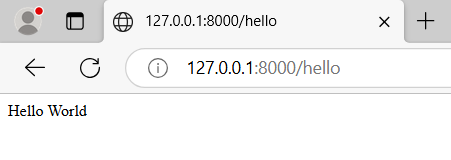

Sesuai, dan web akan menampilkan return yang terdapat pada route halo.

Bukalah pada browser, tuliskan URL untuk memanggil route tersebut:
localhost/PWL_2024/public/world. Perhatikan halaman yang muncul apakah sudah sesuai dan jelaskan pengamatan Anda.

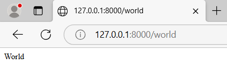

Sesuai, dan web akan menampilkan return yang terdapat pada route world.

Selanjutnya, cobalah membuat route ’/’ yang menampilkan pesan ‘Selamat Datang’.
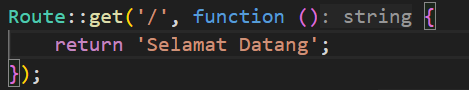
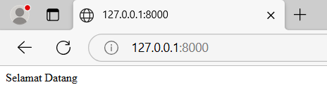

Kemudian buatlah route ‘/about’ yang akan menampilkan NIM dan nama Anda.
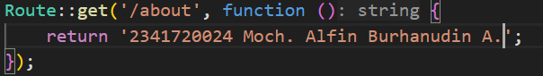
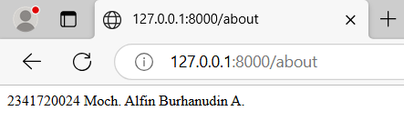

b. Route Parameters

Jalankan kode dengan menuliskan URL untuk memanggil route tersebut:
localhost/PWL_2024/public/user/NamaAnda. Perhatikan halaman yang muncul dan jelaskan pengamatan Anda.
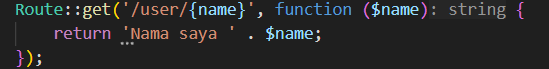
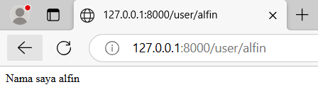

Maka web akan menampilkan return serta nilai dari parameter pada route user.

Selanjutnya, coba tuliskan URL: localhost/PWL_2024/public/user/. Perhatikan halaman yang muncul dan jelaskan pengamatan Anda
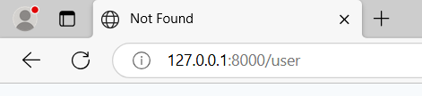

Maka akan terjadi error yaitu not found hal ini terjadi karena pada route user terdapat parameter yang harus diisi.

Jalankan kode dengan menuliskan URL untuk memanggil route tersebut:
localhost/PWL_2024/public/posts/1/comments/5. Perhatikan halaman yang muncul dan jelaskan pengamatan Anda.
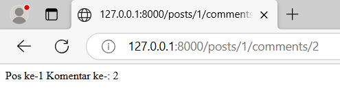

Maka web akan menampilkan return serta nilai dari parameter posts dan comment pada router tersebut.

Kemudian buatlah route /articles/{id} yang akan menampilkan output “Halaman Artikel dengan ID {id}”, ganti id sesuai dengan input dari url.
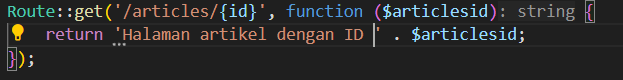
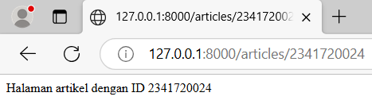

c. Optional Parameter

Jalankan kode dengan menuliskan URL: localhost/PWL_2024/public/user/.Perhatikan halaman yang muncul dan jelaskan pengamatan Anda.
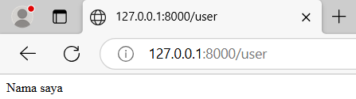

Maka web tidak terjadi error karena untuk nama sudah di set default menjadi null, sehingga jika tidak ada inputan nilai parameter maka nilai parameter menjadi null atau kosong.

Selanjutnya tuliskan URL: localhost/PWL_2024/public/user/NamaAnda Perhatikan halaman yang muncul dan jelaskan pengamatan Anda
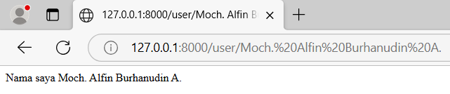

Maka web akan menampilkan return dan nilai dari parameter nama karena parameter nama diisi dengan nama saya.

Jalankan kode dengan menuliskan URL: localhost/PWL_2024/public/user/.Perhatikan halaman yang muncul dan jelaskan pengamatan Anda.
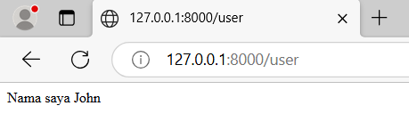

Seperti halnya tadi web tidak akan error ketika parameter tidak diisi namun web akan menampilkan nilai default dari parameter tersebut.
